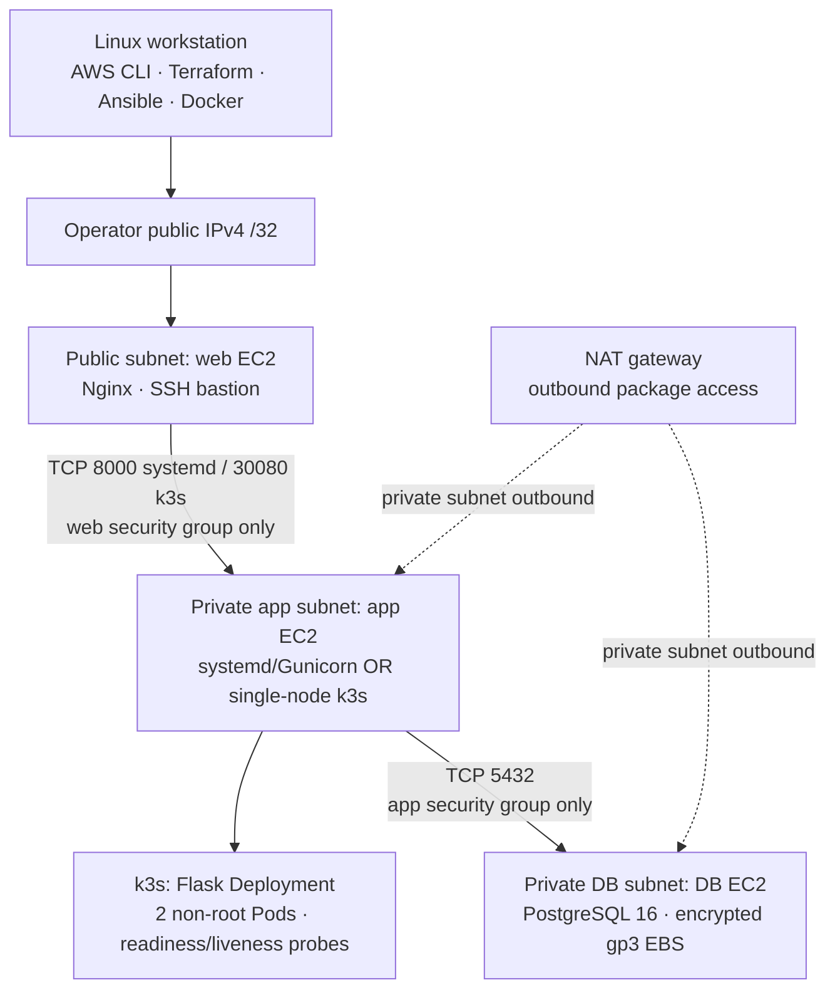
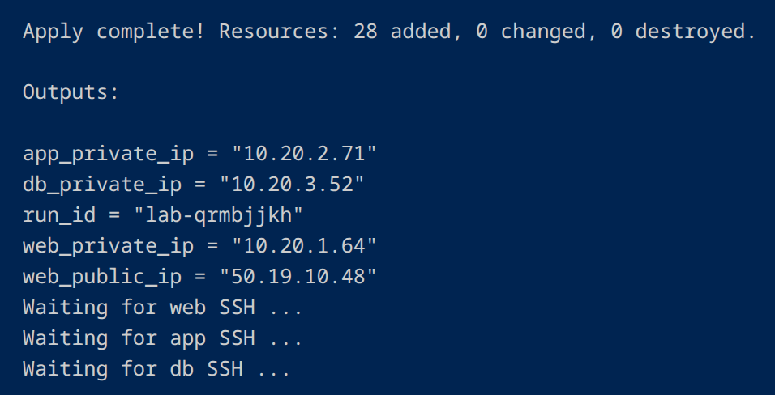
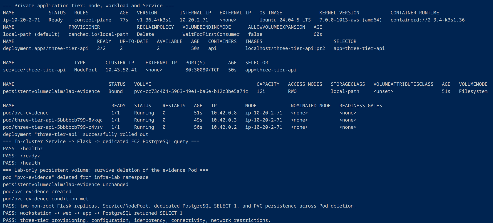
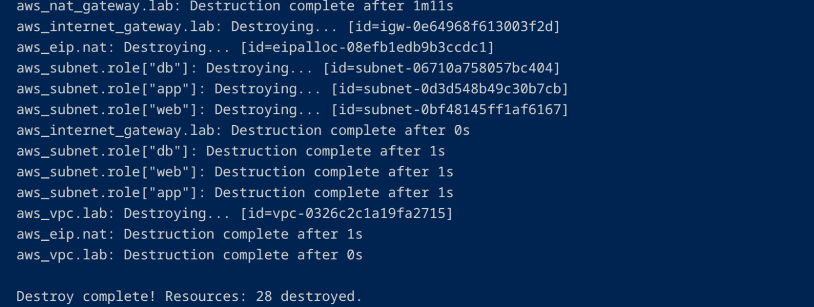
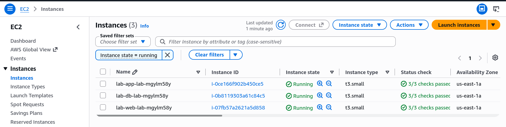
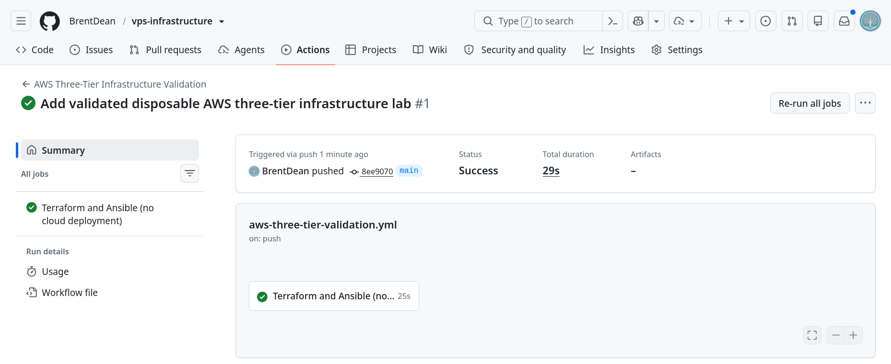
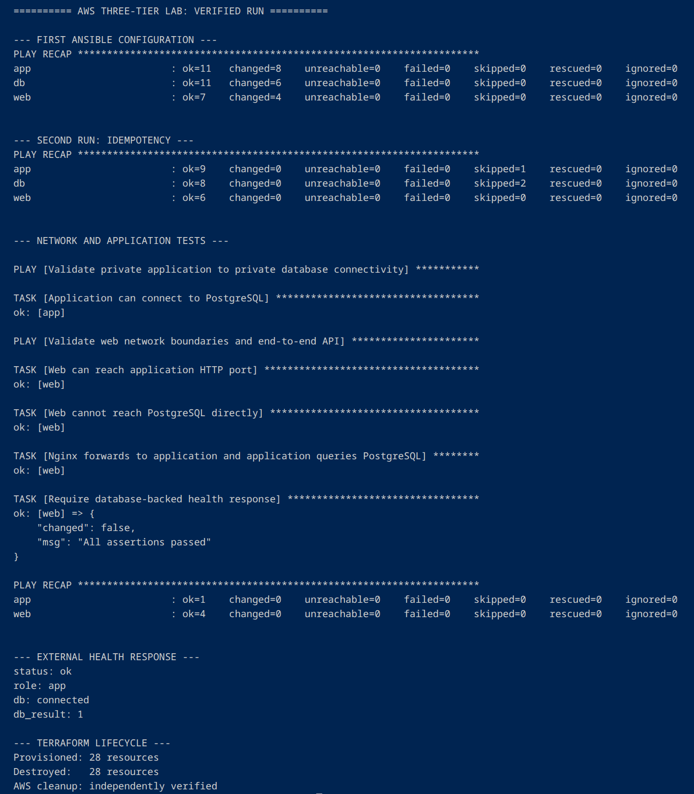

# Cloud Infrastructure Automation

[](https://github.com/BrentDean/cloud-infrastructure-automation/actions/workflows/aws-three-tier-validation.yml)
[](https://github.com/BrentDean/cloud-infrastructure-automation/actions/workflows/python-api-validation.yml)
[](https://github.com/BrentDean/cloud-infrastructure-automation/actions/workflows/k3s-validation.yml)

**One AWS lab, two application runtimes, a verified end-to-end infrastructure lifecycle.**

**LabOps operator dashboard (local/CI verification; AWS regression pending):** The same Flask/PostgreSQL application now has a responsive, same-origin browser workspace for incident triage, manual synthetic Cowrie evidence entry, and read-only, time-windowed SSH investigation. It uses the existing three-tier infrastructure and supports an explicitly seeded localhost demo. No security response is executed. [Dashboard, API contracts and local demo →](docs/labops.md)

Build a three-tier AWS environment from an empty VPC, configure the Linux hosts, deploy a database-backed Python API through either **Gunicorn/systemd** or **k3s**, verify allowed and denied network paths, and destroy the billable resources. The project is designed to be rebuilt on demand, **not** left running as a public production service.

| Live deployment | Date | Result |
| --- | --- | --- |
| Original Gunicorn/systemd mode | September 22, 2026 | 28 resources created; application/DB tests passed; Ansible second pass `changed=0` on all three hosts; 28 destroyed |
| Private k3s mode | **September 24, 2026** | **2/2 non-root Flask Pods**, NodePort and DB-backed health checks passed, test PVC survived Pod replacement, web-to-DB isolation passed, configured-tier Ansible second pass `changed=0`, **28 resources destroyed** |

[**Live k3s verification record →**](docs/live-verification-2026-09-24.md) · [AWS deployment runbook](docs/aws-three-tier.md) · [k3s runbook](docs/kubernetes-k3s.md) · [Architecture decisions](docs/architecture-decisions.md)

## Architecture at a glance



One `10.20.0.0/16` VPC; a public subnet for the web tier; separate private subnets for application and database; an internet gateway and NAT gateway; and ephemeral operator SSH credentials. Neither the app nor DB EC2 has a public IP. Web HTTP/SSH ingress is restricted to the operator's current IPv4 `/32`. This is **single-AZ, single-node k3s**, not EKS, multi-node HA or a production-ready public API.

### Same application, two deployment paths

| Concern | Original AWS mode | AWS k3s mode |
| --- | --- | --- |
| Application host | Private EC2, `t3.small` by default | **Same private app tier**, `t3.medium` by default |
| Application | Flask served by Gunicorn and systemd | Same Flask source packaged into a non-root Docker image |
| HTTP backend | TCP `8000` | Kubernetes Service/NodePort `30080`, only from web SG |
| Process/workload management | systemd | Single-node k3s, Deployment with two Pods, probes |
| Database | Dedicated private PostgreSQL 16 EC2 | **The same dedicated private PostgreSQL EC2** |
| Public entry | Operator-/32 Nginx `/health` | Same Nginx web server and SSH bastion |
| Lifecycle | Terraform → Ansible → tests → destroy | Terraform → Ansible → k3s → Kubernetes → tests → destroy |

The extra **1 GiB local-path PVC** belongs to a disposable *evidence Pod*, not PostgreSQL. The test confirms that a file survives **Pod deletion and recreation on the same node**; it does not claim survival of EC2 destruction. [Rationale and limitations →](docs/architecture-decisions.md)

## Live AWS k3s verification — September 24, 2026

The following results are from the **billable AWS deployment**, not just GitHub Actions or offline manifest validation.

```text
AWS Terraform apply          28 resources added; 0 errors
Private k3s node             Ready
Flask Deployment             2/2 available
Kubernetes Service           NodePort 80:30080/TCP
Evidence PVC                 Bound (1 GiB, local-path)

PASS /healthz                process liveness
PASS /readyz                 database-backed readiness
PASS /health                 dedicated PostgreSQL SELECT 1
PASS                        non-root Flask replicas and Service/DNS
PASS                        PVC marker after evidence Pod deletion/recreation
PASS                        workstation → Nginx → k3s → PostgreSQL SELECT 1
PASS                        web → app allowed; app → DB allowed
PASS                        direct web → PostgreSQL blocked
PASS                        second Ansible configuration: changed=0 (web, DB)

Terraform destroy            28 resources destroyed
```

The first Ansible pass configured PostgreSQL and Nginx; [`ansible/k3s/install.yml`](ansible/k3s/install.yml) installed k3s on the private app EC2. The second configuration pass verified idempotency on the **web and DB plays**; the systemd app play was intentionally skipped in k3s mode. The live test does not establish HA, a full k3s re-run idempotency test, or off-node disaster recovery.

[Full verification details, checks and evidence-handling notes →](docs/live-verification-2026-09-24.md)

### Visual evidence from the live run

Images are displayed at a consistent preview width; **click any screenshot to inspect the original, full-resolution terminal output**.

**1. Terraform provisions the three AWS tiers.** The initial apply created 28 resources and returned the public web and private application/database addresses.

<a href="screenshots/aws-three-tier/k3s/01-terraform-apply.png"></a>

**2. Kubernetes runs the database-backed application.** The private k3s node is Ready; both Flask replicas are available; the NodePort Service, test PVC, health endpoints and persistence test pass.

<a href="screenshots/aws-three-tier/k3s/04-k3s-workloads-and-verification.png"></a>

**3. Automated teardown removes the lab.** Terraform destroys the NAT gateway and remaining networking resources, then reports all 28 resources destroyed.

<a href="screenshots/aws-three-tier/k3s/07-terraform-destroy-28-resources.png"></a>

[**View all seven live-run screenshots →**](docs/live-verification-2026-09-24.md#screenshots-from-the-live-run) — including Ansible installation, Kubernetes workload creation, configuration idempotency and the negative network security test.

### What the September 24 run actually deployed

The retained terminal record confirms **Ubuntu 24.04.5 LTS** on the private app host, **k3s v1.36.4+k3s1** with containerd, a `Ready` control-plane node without an external IP, and a `2/2` Flask Deployment with **zero Pod restarts at verification**. The same run created a runtime namespace (`infra-lab`), a database-host ConfigMap, a database-authentication Secret, a private Service on `80:30080/TCP` and a **Bound** `1 GiB` test PVC. The image was built for EC2's amd64 platform and imported through the bastion rather than pulled from a public registry.

The DB and web Ansible plays finished with `failed=0`, then both returned `changed=0` on the second pass. The network smoke tests checked an intentionally **denied** web→PostgreSQL connection as well as the allowed paths. AWS NAT gateway provisioning took **1m44s** and deletion **1m11s** in this particular run; these are observations, not guaranteed timings. [See the full sanitized run chronology →](docs/live-verification-2026-09-24.md#observed-deployment-sequence-and-runtime)

## Engineering capabilities demonstrated

| Area | Implemented and exercised |
| --- | --- |
| AWS networking | VPC, three subnets, IGW, NAT/EIP, routing, EC2 roles, scoped security groups, ephemeral SSH bastion |
| Infrastructure as Code | Terraform plan/apply/output/destroy, state isolation per run, cleanup recovery, runtime-dependent app sizing and ingress |
| Linux automation | Ansible apt, config files, systemd services, handlers, cloud-init waits, repeatable configuration, idempotency check |
| Containers and Kubernetes | Docker build, private SSH image transfer, containerd import, k3s, Namespace, Deployment, Service, NodePort, health probes |
| Application integration | Shared Flask source, dedicated PostgreSQL 16, DB-backed health API and app credentials supplied at runtime |
| Security controls | Web /32, no public app/DB IP, explicit denied-path test, non-root containers, runtime-only Kubernetes Secret, encrypted EBS |
| Storage testing | Test-only local-path PVC marker retained after Pod replacement; no DR claim |
| CI and test automation | Python API tests, local Docker/PostgreSQL outage/recovery, Terraform/Ansible validation, offline k3s/cross-layer contract checks |
| Operational lifecycle | Real AWS smoke tests, machine-readable evidence, best-effort automatic destruction and manual recovery if needed |

**The application health endpoints have different jobs:** `/healthz` checks process liveness without requiring PostgreSQL; `/readyz` performs a real `SELECT 1` and can mark a Pod unready during a DB outage; `/health` preserves the original Nginx-to-database verification contract. [API tests and endpoint behavior →](docs/three-tier-api.md)

## Architecture, code and operator workflow

| Component | Source |
| --- | --- |
| AWS VPC, subnets, EC2, SGs, NAT and volumes | [`terraform/aws-three-tier/`](terraform/aws-three-tier/) |
| Full lifecycle orchestrator | [`scripts/run-aws-three-tier.sh`](scripts/run-aws-three-tier.sh) |
| PostgreSQL, systemd application and Nginx configuration | [`ansible/aws-three-tier/configure.yml`](ansible/aws-three-tier/configure.yml) |
| Private Kubernetes installer | [`ansible/k3s/install.yml`](ansible/k3s/install.yml) |
| Kubernetes Deployment, Service and test PVC | [`kubernetes/k3s/`](kubernetes/k3s/) |
| Image deployment and live Kubernetes assertions | [`scripts/k3s/aws-deploy.sh`](scripts/k3s/aws-deploy.sh), [`aws-verify.sh`](scripts/k3s/aws-verify.sh) |
| Three-tier connectivity and negative security checks | [`ansible/aws-three-tier/smoke-test.yml`](ansible/aws-three-tier/smoke-test.yml) |
| Shared Flask application and container | [`apps/three-tier-api/`](apps/three-tier-api/) |
| Cross-layer and workflow validation | [`scripts/validate_architecture.py`](scripts/validate_architecture.py), [`.github/workflows/`](.github/workflows/) |

### Reproduce an ephemeral live run

**AWS charges apply** (particularly EC2, NAT gateway, EBS and public IPv4). Use a non-root AWS principal in the intended test account and keep your workstation online through teardown.

```bash
cd /path/to/cloud-infrastructure-automation

AWS_PROFILE=vps-lab aws sts get-caller-identity
docker info >/dev/null

# Original verified application runtime
AWS_PROFILE=vps-lab bash scripts/run-aws-three-tier.sh --run

# Same AWS topology with k3s on the private app tier
AWS_PROFILE=vps-lab LAB_APP_RUNTIME=k3s \
  bash scripts/run-aws-three-tier.sh --run
```

NAT gateway creation typically takes **approximately 2–5 minutes** (sometimes longer). The runner limits inbound traffic to the operator `/32`, rejects root credentials, generates a fresh SSH key/database password, saves evidence to a private per-run directory, and **attempts Terraform destroy even on failure**. If teardown fails, use [the manual recovery script](scripts/destroy-aws-three-tier.sh) and retain the private state until resources are gone. An AWS Budget alert does not shut down resources.

**GitHub Actions performs non-billable checks; it never provisions this AWS lab.** Do not publish Terraform state, private SSH keys, passwords, or raw private run directories.

## Evidence and project boundaries

The original **September 22 systemd deployment** is pictured below. These images are historical baseline evidence, **not screenshots of the September 24 k3s run**.

<details>
<summary>View original systemd-mode AWS screenshots</summary>







</details>

**Implemented and live-tested:** the two AWS runtime modes and the checks documented above. **Not yet implemented or verified:** Kubernetes update/failure-injection exercises; CloudWatch alerting/incident response and dedicated least-privilege IAM roles for the lab; independent PostgreSQL backup/rebuild with measured RPO/RTO. Those are the next extensions of this *same architecture*, not separate unrelated demos.

The repository also includes [Ansible staging-server backups](ansible/backup.yml) and [infrastructure audits](ansible/audit.yml) for an **existing, separate Hetzner VPS**. The disposable AWS runner does **not** connect to or modify that server.
