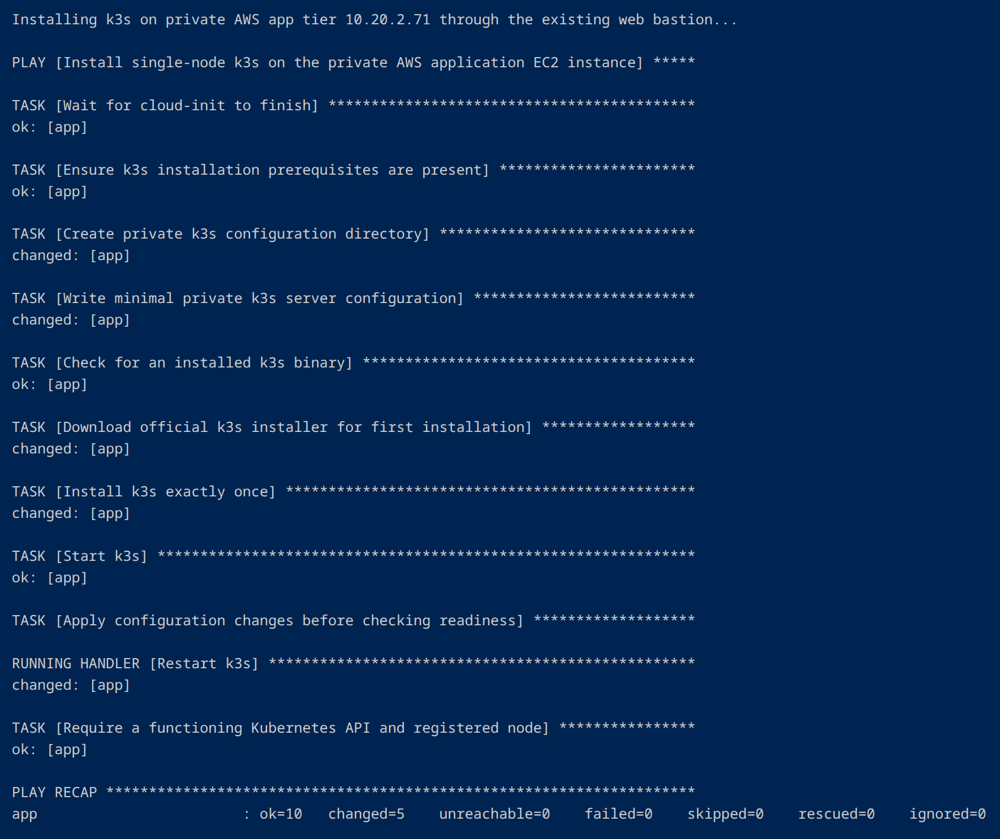
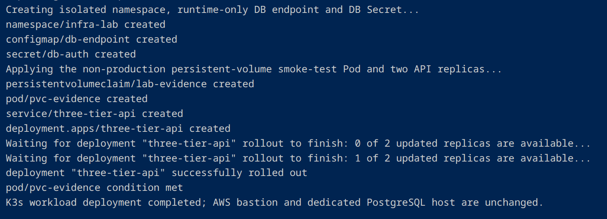
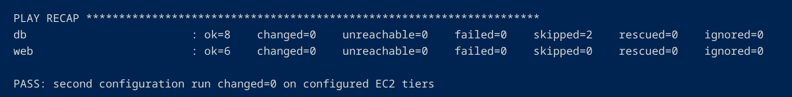

# Live AWS k3s verification record — September 24, 2026

**Status: verified in a billable AWS lab in `us-east-1`.** The k3s mode reused the original three-tier Terraform root, Nginx/SSH bastion, and separate PostgreSQL EC2. The test ended with successful Terraform destruction of **28 managed resources**. These observations are separate from the original systemd/Gunicorn deployment verified September 22.

## Deployed infrastructure

| Layer | Live result |
| --- | --- |
| AWS infrastructure | One VPC; one public web subnet; distinct private app and DB subnets; NAT, IGW, security-group boundaries; three EC2 instances |
| Web | `t3.small`, Nginx HTTP `/health`, SSH bastion; public ingress restricted to operator IPv4 `/32` |
| Application | Private `t3.medium` running single-node k3s; Kubernetes node reported `Ready` |
| DB | Private `t3.small` running dedicated PostgreSQL 16; permitted app-only DB traffic |
| API Pods | Deployment `three-tier-api` reported **2/2 available**, both running without root |
| Service | Internal Kubernetes Service with `NodePort 30080`, admitted only from the web security group |
| Test volume | `lab-evidence` PVC reported `Bound`, 1 GiB `local-path` storage |

The workstation built the image, sent it through the existing web SSH bastion to the app host, and imported it into the private node's containerd image store. No EKS cluster, extra public server, or public container registry was required.

## Observed deployment sequence and runtime

These details come from the **operator's September 24 terminal transcript**, rather than inferred capability from static configuration alone. The table intentionally omits account numbers, transient public/private IPs, full SSH key names and credentials.

| Step | Observed output |
| --- | --- |
| Terraform provisioning | `Apply complete! Resources: 28 added, 0 changed, 0 destroyed.` |
| Gateway readiness | NAT gateway created in **1m44s**; private routing completed before launching EC2 |
| EC2 and storage | Web `t3.small` / 12 GiB gp3; private app `t3.medium` / 24 GiB gp3; private DB `t3.small` / 12 GiB gp3. Root EBS volumes encrypted and deleted with their instances |
| Initial Ansible pass | DB `ok=11 changed=6 failed=0`; web `ok=7 changed=4 failed=0` |
| Private Kubernetes install | Ansible app recap `ok=10 changed=5 failed=0`; Kubernetes API and node readiness check passed |
| Observed Kubernetes node | Ubuntu **24.04.5 LTS**, **k3s v1.36.4+k3s1**, containerd **2.3.4-k3s1.36**, reported `Ready` with no external IP |
| Container delivery | Workstation Docker built `localhost/three-tier-api:pr2` for linux/amd64; image transferred through the existing SSH bastion to private k3s containerd |
| Runtime configuration | Kubernetes namespace `infra-lab`; `db-endpoint` ConfigMap and `db-auth` Secret created at runtime, not committed with credentials |
| Application rollout | `three-tier-api` Deployment successfully rolled out with `2/2` available; both API Pods displayed `1/1 Running` and **0 restarts** when inspected |
| Service and evidence storage | `three-tier-api` NodePort `80:30080/TCP`; test PVC `lab-evidence` **Bound**, `1Gi`, `RWO`, `local-path`; evidence Pod `1/1 Running` |
| Repeat Ansible pass | DB `ok=8 changed=0 failed=0`; web `ok=6 changed=0 failed=0` |
| Gateway teardown | NAT gateway deletion completed in **1m11s**, followed by EIP/VPC cleanup |
| Complete teardown | `Destroy complete! Resources: 28 destroyed.` |

The recorded NAT times are **one run's measurements**, not a service-level expectation. The operating system and Kubernetes versions are also observations from that run, not a claim that future uses of the unpinned k3s stable channel will install the same version.

## Observed validation

| Check | Observed outcome |
| --- | --- |
| Python process liveness `/healthz` | PASS |
| DB-backed Kubernetes readiness `/readyz` | PASS |
| Original `/health` and dedicated DB `SELECT 1` | PASS |
| Internal Service DNS / application network path | PASS |
| Two non-root replicas and deployment rollout | PASS |
| Test PVC marker after deleting **only the evidence Pod** and recreating it | PASS |
| External workstation → Nginx → private NodePort → Flask → PostgreSQL `SELECT 1` | PASS |
| App EC2 → PostgreSQL TCP 5432 | PASS |
| Web EC2 → application NodePort 30080 | PASS |
| Web EC2 → PostgreSQL TCP 5432 | Blocked, as intended |
| Second Ansible configuration run, web and DB plays | `changed=0`, `failed=0`, `unreachable=0` |
| Terraform cleanup | `Destroy complete! Resources: 28 destroyed.` |

The first Ansible pass configured database and web instances. The systemd application play was tagged out of the k3s variant, so its idempotency is **not** included in the k3s second-pass claim. The separate k3s install play and Kubernetes manifests were exercised successfully in the live run.

### Sanitized terminal excerpt

```text
deployment.apps/three-tier-api     2/2
service/three-tier-api             NodePort 80:30080/TCP
persistentvolumeclaim/lab-evidence Bound

PASS: /healthz
PASS: /readyz
PASS: /health
PASS: two non-root Flask replicas, Service/NodePort,
      dedicated PostgreSQL SELECT 1, and PVC persistence across Pod deletion.
PASS: workstation -> web -> app -> PostgreSQL returned SELECT 1
PASS: three-tier provisioning, configuration idempotency,
      connectivity, network restrictions.

Destroy complete! Resources: 28 destroyed.
```

This is a condensed excerpt based on the captured September 24 operator output, not a verbatim copy of one contiguous log block. Detailed machine logs were retained in the private evidence directory on the operator workstation.

## Screenshots from the live run

These seven screenshots show the **September 24 AWS k3s deployment in execution order**, from Terraform provisioning through complete teardown. Preview widths are capped for readability; **click any screenshot for the original full-resolution terminal capture**. They are separate from the [September 22 systemd-mode evidence](../screenshots/aws-three-tier/01-ec2-instances.png).

### 1. Provision AWS with Terraform

<a href="../screenshots/aws-three-tier/k3s/01-terraform-apply.png"></a>

The same Terraform root provisions the web, application and database tiers. Only the web EC2 receives a public IP.

### 2. Configure private k3s with Ansible

<a href="../screenshots/aws-three-tier/k3s/02-ansible-k3s-install.png"></a>

The installation play completes with `failed=0`. k3s is installed on the existing private app EC2, not a fourth host or EKS control plane.

### 3. Create the Kubernetes workload

<a href="../screenshots/aws-three-tier/k3s/03-k3s-workload-deployment.png"></a>

The namespace, runtime-only DB configuration, workload and test storage are created. The Deployment progresses from zero available replicas to two.

### 4. Verify the private application tier

<a href="../screenshots/aws-three-tier/k3s/04-k3s-workloads-and-verification.png"></a>

The node is Ready, both API Pods are Running with zero observed restarts, and `/healthz`, `/readyz` and `/health` pass. The test-only PVC retains its marker after **only the evidence Pod** is deleted and recreated.

### 5. Verify Ansible idempotency

<a href="../screenshots/aws-three-tier/k3s/05-ansible-idempotency.png"></a>

Both configured tiers report `changed=0` and `failed=0`. The systemd application play is intentionally skipped in k3s mode; this screenshot does not prove full-cluster second-run idempotency.

### 6. Validate network restrictions and the database-backed API

<a href="../screenshots/aws-three-tier/k3s/06-network-boundaries-and-database-smoke.png"></a>

Positive connectivity checks and the negative web→PostgreSQL test pass. The Nginx-to-Flask-to-dedicated-PostgreSQL request returns the expected health response.

### 7. Destroy all AWS lab resources

<a href="../screenshots/aws-three-tier/k3s/07-terraform-destroy-28-resources.png"></a>

The final recorded output is `Destroy complete! Resources: 28 destroyed.` This confirms successful Terraform-managed teardown for this run; it is not a claim that the entire AWS account is empty.

## What the evidence does—and does not—establish

- **Does:** prove a real single-AZ AWS deployment, private Kubernetes workload, two working replicas, end-to-end DB connectivity, a denied network path, Pod-level PVC persistence and full Terraform teardown.
- **Does not:** prove availability across Kubernetes nodes/AZs; a rolling-upgrade or deliberately induced failure recovery test; backup of PostgreSQL outside the DB EC2; persistence through EC2 deletion; a complete second-run idempotency check for all k3s resources; TLS for a publicly accessible application.
- The PVC belongs to the **test-only evidence Pod**. The actual PostgreSQL database stays on the private DB EC2 and is destroyed with the ephemeral lab.


### Verification nuances

The original application Ansible play is skipped for k3s mode; the second-pass `changed=0` claim is specific to **web and DB**, while the separate k3s install play was verified by API/node readiness and workload rollout. Kubernetes readiness passed against dedicated PostgreSQL; process liveness is independent of a database query. The test PVC retained its marker across deletion and recreation of **only** `pvc-evidence`, with the claim preserved. Both API replicas run on **one EC2 node**, so `2/2` is a workload availability result, not multi-node or multi-AZ availability.

The full transcript also contains unrelated TorKit operations and temporary operator tokens; those are **not part of this AWS evidence record** and should not be published as a raw unredacted file.

## Operational evidence handling

The runner writes `configure-first.log`, `configure-second.log`, `k3s-ansible.log`, `k3s-deploy.log`, `k3s-verification.log`, `smoke-test.log`, `external-health.json` and `run-summary.txt` to the per-run `evidence/` directory. The parent run directory can also contain Terraform state, database secrets and temporary SSH credentials; **never commit the entire run directory**. Capture screenshots that show system state and test results without publishing secrets.

For reproduction and cost controls, see [the k3s runbook](kubernetes-k3s.md) and [the primary README](../README.md).
